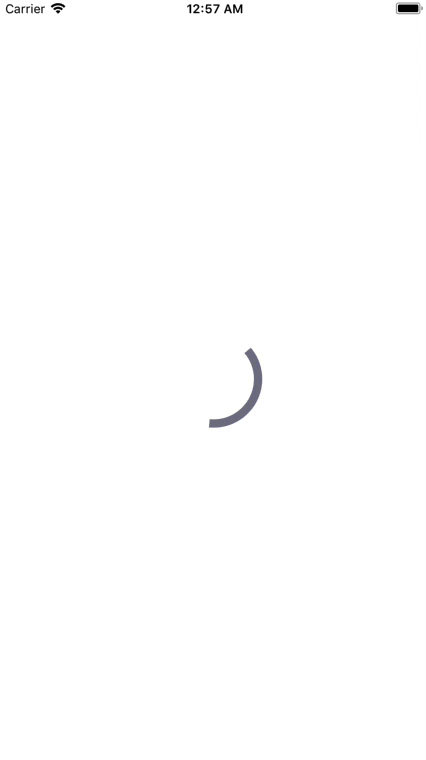

# DTCircularActivityIndicator

[](https://travis-ci.org/thinhv@metropolia.fi/DTCircularActivityIndicator)
[](http://cocoapods.org/pods/DTCircularActivityIndicator)
[](http://cocoapods.org/pods/DTCircularActivityIndicator)
[](http://cocoapods.org/pods/DTCircularActivityIndicator)



## Example

To run the example project, clone the repo, and run `pod install` from the Example directory first.

## Installation

DTCircularActivityIndicator is available through [CocoaPods](http://cocoapods.org). To install
it, simply add the following line to your Podfile:

```ruby
pod 'DTCircularActivityIndicator'
```

## Usage
You can easily customize the animation with the following self-descriptive properties:

- `lineWidth`: This property controls the width of the circular stroke path
- `strokeStartDuration`: Duration for stroke start animation
- `strokeEndDuration`: Duration for stroke end animation
- `spinDuration`: Rotating duration for 2pi

## Author

ducthinh2410@gmail.com

## License

DTCircularActivityIndicator is available under the MIT license. See the LICENSE file for more info.
